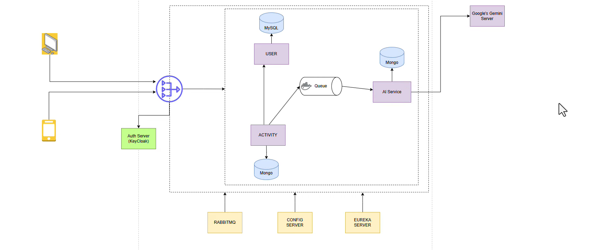

🏋️ AI-Powered Fitness Microservices Platform

A **Spring Boot-based microservices architecture** that enables users to track fitness activities and receive **AI-driven personalized recommendations** using asynchronous event-driven communication and secure authentication.

🚀 Overview

This platform allows users to:

* Register and authenticate securely
* Track fitness activities
* Receive intelligent recommendations including:

  * Performance improvements
  * Next set of exercises
  * Safety precautions
  * Overall fitness analysis

The system is designed using **modern distributed system principles**, ensuring scalability, loose coupling, and real-time processing.

 🧩 Microservices Architecture

🔹 User Service

* Handles:

  * User registration
  * Fetch user by ID
  * Validate user by ID
* Database: **PostgreSQL**
* Synchronizes user data with Keycloak

 🔹 Activity Service

* Handles:

  * Activity tracking
  * Save activity
  * Fetch activity by Activity ID
  * Fetch activity by User ID
* Database: **MongoDB**
* Uses **WebClient** for inter-service communication (User validation)
* Publishes events to RabbitMQ after activity creation

🔹 AI Service

* Consumes activity events from RabbitMQ
* Calls **Google Gemini API** for generating recommendations
* Processes AI response using Core Java
* Stores structured recommendations in MongoDB

🌐 System Components

* **API Gateway** – Entry point for all client requests
* **Eureka Server** – Service discovery and registration
* **RabbitMQ** – Asynchronous event-driven communication
* **Keycloak** – Authentication and authorization server

All services are containerized using Docker.

🔄 Application Flow

1. User registers via Keycloak (PKCE flow)
2. User data is synchronized with User Service (PostgreSQL)
3. User performs activity → Activity Service stores it
4. Activity Service validates user via User Service (WebClient)
5. Activity event is published to RabbitMQ
6. AI Service consumes event
7. AI Service calls Gemini API
8. Recommendation is processed and stored

 🔐 Security

* Authentication using **Keycloak**
* Implements **OAuth2 PKCE Authorization Code Flow**
* User synchronization:

  * User registered in Keycloak
  * Automatically stored in User Service DB

⚙️ Tech Stack

* **Backend:** Java, Spring Boot
* **Microservices:** Spring Cloud (Eureka, Gateway)
* **Security:** Keycloak (OAuth2 + PKCE)
* **Databases:**

  * PostgreSQL (User Service)
  * MongoDB (Activity & AI Service)
* **Messaging:** RabbitMQ
* **Inter-service Communication:** WebClient
* **AI Integration:** Google Gemini API
* **Containerization:** Docker
* **Build Tool:** Maven

📌 Key Features

* ✅ Microservices-based architecture
* ✅ API Gateway + Service Discovery (Eureka)
* ✅ Event-driven system using RabbitMQ
* ✅ AI-powered recommendation engine
* ✅ Secure authentication using Keycloak (PKCE flow)
* ✅ Inter-service communication via WebClient
* ✅ Polyglot persistence (PostgreSQL + MongoDB)
* ✅ Dockerized services

⚙️ How to Run

1. Start Docker containers:

   * Keycloak
   * RabbitMQ
   * Eureka Server

2. Start services in order:

   * User Service
   * Activity Service
   * AI Service
   * API Gateway

 🚧 Future Enhancements

* Add centralized logging (ELK stack)
* Implement distributed tracing (Zipkin)
* Add CI/CD pipeline (GitHub Actions)
* Deploy on Kubernetes / AWS
* Add rate limiting in API Gateway

 👨‍💻 Author
Gourav Kumar
